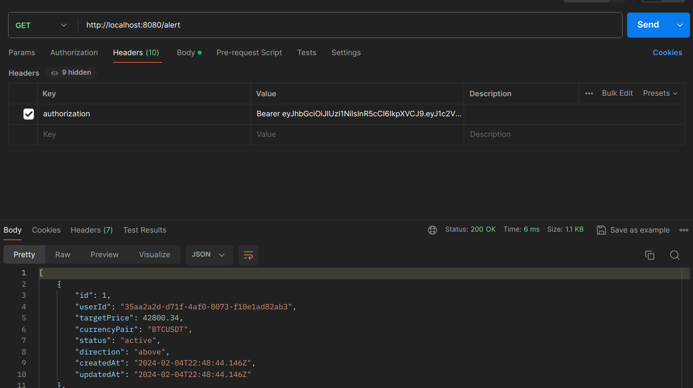
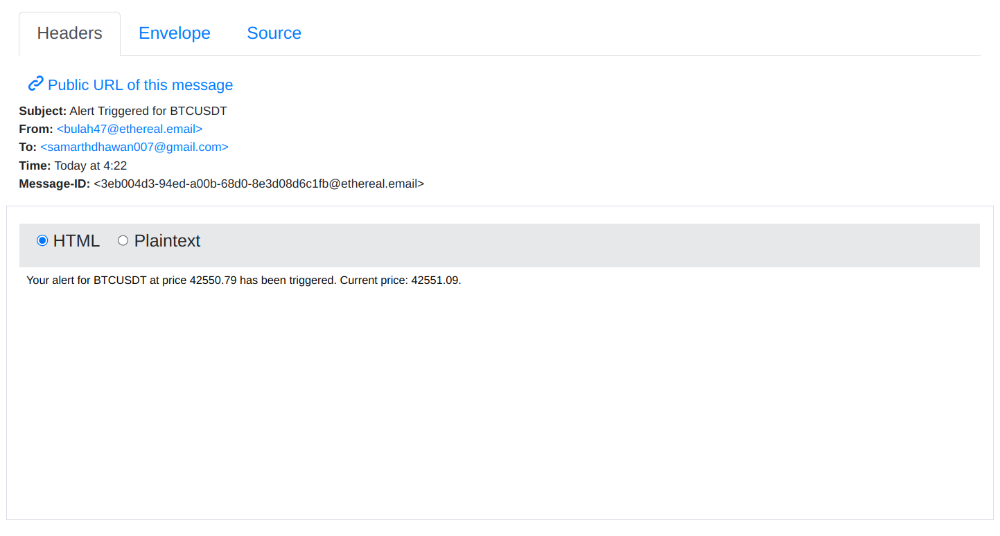

# Price Alert App

- This application enables users to monitor cryptocurrency prices in real-time and receive notifications when specific price targets are reached. Users can register, log in, create price alerts, and manage these alerts through a REST API. The application leverages WebSockets for real-time price updates, Redis for caching, and RabbitMQ for managing email notifications.

## 🛠️ Local development

### Step 1: Creating a New `.env` File

- The project includes a template `.env.example` file that lists all the necessary environment variables without their actual values. You'll need to create a new `.env` file based on this template and fill in the values specific to your setup.

### Instructions:

1. **Copy the `.env.example` file to create a `.env` file:**

- **Unix/Linux/MacOS:**
  Open your terminal and run the following command in the project root directory:

      ```bash
      cp .env.example .env
      ```

- **Windows:**

  Open Command Prompt and execute:

  ```cmd
  copy .env.example .env
  ```

2. **Fill in the `.env` file with your specific values:**

## Step 2: Understanding the Environment Variables

Here's an explanation of common environment variables you might encounter:

- `DB_HOST`: The hostname or IP address of your database server.
- `DBNAME`: The name of the database your application will use.
- `USERNAME`: The username for database access.
- `PASSWORD`: The password for database access.
- `PORT`: The port number your application will run on.
- `JWT_TOKEN`: A secret key used for signing JWT tokens.
- `EMAIL`: Your email or notification service login.
- `EMAIL_PASSWORD`: Your email or notification service password.
- `EMAIL_HOST`: The SMTP server address for your email service.
- `EMAIL_PORT`: The SMTP server PORT for your email service.

## Step 3: Running the Application

### Building Docker Images

1. Open a terminal and navigate to your project's root directory.
2. Build Docker images with the command:
   ```sh
   docker compose build
   ```

### Starting the Application

1. Start the Application by running the command:

   ```sh
   docker compose up
   ```

2. Use -d to run in detached mode:

   ```sh
   docker compose up -d
   ```

## API ENDPOINTS

### Register

- **POST** `/register`
  - **Description**: Registers a new user with a username and password.
  - **Request Body**:
    ```json
    {
      "username": "user1",
      "password": "password123"
    }
    ```
  - **Success Response**: `201 Created`
  - **Error Response**: `400 Bad Request` if the username is already taken.

### Login

- **POST** `/login`
  - **Description**: Authenticates a user and returns a JWT token.
  - **Request Body**:
    ```json
    {
      "username": "user1",
      "password": "password123"
    }
    ```
  - **Success Response**: `200 OK` with JWT token.
  - **Error Response**: `401 Unauthorized` if credentials are incorrect.
  <hr>

**Before interacting with the endpoints (createAlert, deleteAlert, getAllALerts), ensure you attach the authentication bearer token in the authorization header that is returned in login request. This token is required for authenticating your requests.**



<hr>

### Create Alert

- **POST** `/alert`
  - **Description**: Creates a new price alert for a specific user.
  - **Request Body**:
    ```json
    {
      "currencyPair": "BTCUSTD",
      "targetPrice": 50000
    }
    ```
  - **Success Response**: `201 Created`
  - **Error Response**: `400 Bad Request` if the input is invalid.

### Delete Alert

- **DELETE** `/alert/delete/:id`
  - **Description**: Deletes a specific alert by its ID.
  - **Success Response**: `200 OK`
  - **Error Response**: `404 Not Found` if the alert ID does not exist.

### Get All Alerts + Filter

- **GET** `/alert` or '/alert?status=active | triggered'
- **NOTE: In the status query parameter, you can pass either active or triggered to filter the alerts based on their status. If no status is passed, all alerts are returned.**
  - **Description**: Fetches all alerts for the logged-in user, with optional filtering.
  - **Query Parameters**:
    - `currency` (optional): Filter alerts by currency.
  - **Success Response**: `200 OK` with a list of alerts.
  - **Error Response**: `500 Internal Server Error` if an error occurs

## Real-Time Price Monitoring with WebSockets

The application uses WebSockets to subscribe to a cryptocurrency price feed, allowing it to receive and process price updates in real-time. When the current price of a cryptocurrency meets or exceeds the target price set in any user alert, the application proceeds to notify the user.

## Email Notification via Nodemailer and RabbitMQ

When an alert condition is met, the application sends a message to a RabbitMQ queue, indicating that an email notification should be sent. A separate worker service listens on this queue, extracts email notification tasks, and uses Nodemailer to send the emails. This decouples the email sending process from the main application logic, improving scalability and reliability.



## Using Redis for Caching

Redis is utilized to cache frequently accessed data, such as active alerts or recent price information. This reduces response times and decreases the load on the primary database.

## Summary

This documentation outlines the key functionalities of your application, emphasizing user management, alert operations, real-time data handling with WebSockets, and asynchronous email notifications via RabbitMQ. The use of Redis for caching enhances the application's performance and efficiency.
